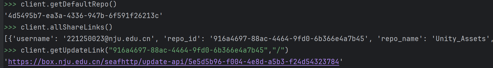
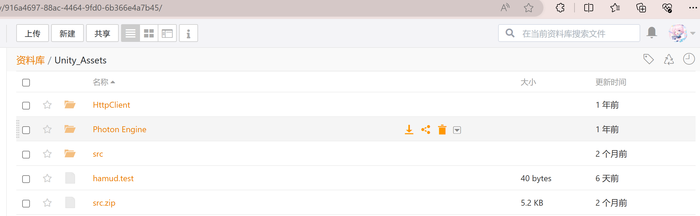
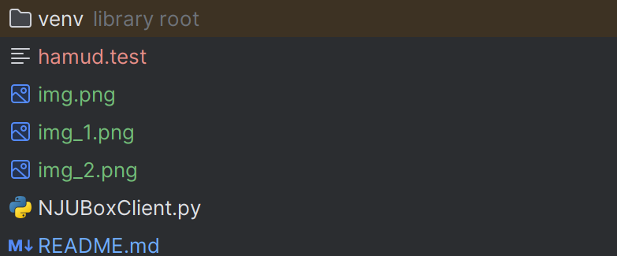
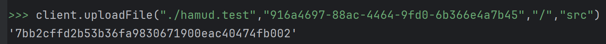
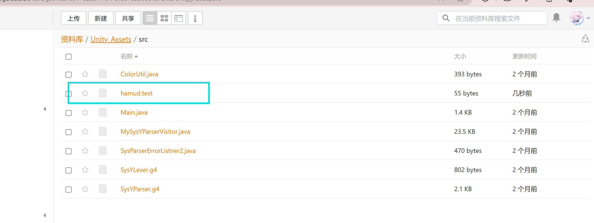
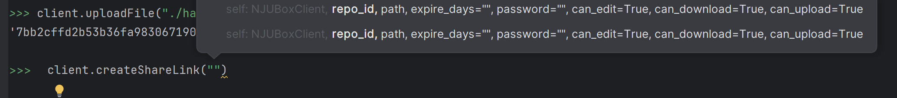
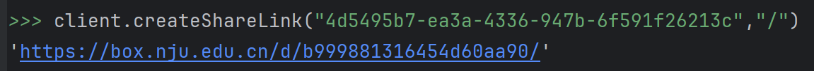

# NJUBOX SDK
Use NJUBox™ as an OSS or data storage on your server or web application

Smooth integration Of NJUBox in your application

## Usage
### import & init
```python
import NJUBoxClient
njuClient = NJUBoxClient("<YOUR NJU ID>","<AUTHSERVER PASSWORD>","<YOUR WEBAPP NAME>")
```
### API 
Because NJUBOX is developed using Seafile, all the APIs are sealed correspondent to Seafile Official API

Please visit https://seafile-api.readme.io/

The Project has already realized interfaces of:
```text
getDefaultRepo
downloadFile
getUploadLink
getUpdateLink
updateFile
uploadFile
createShareLink
allShareLinks
```

### API Usage Examples








In the future it will realize
```text
Group or library management
Webhook integration(Collaboration Table)
QQ ,Enterprise Wechat, Dingtalk.....integration(Collaboration Table)
QLab™(A developing GoogleColab™-like system) quick mounting and file collaboration
```